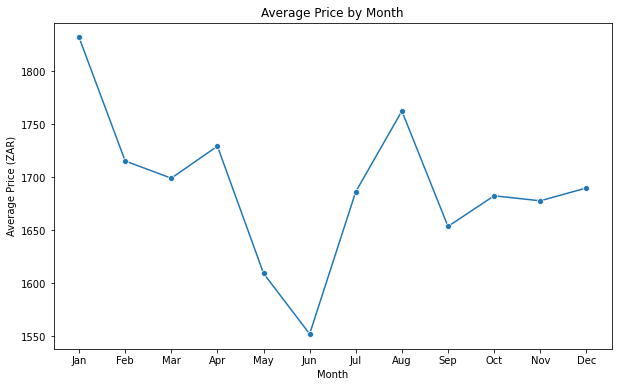
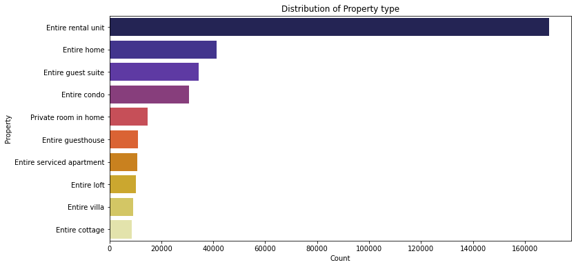
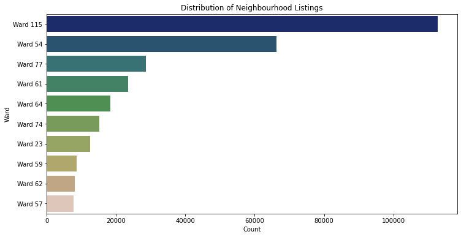
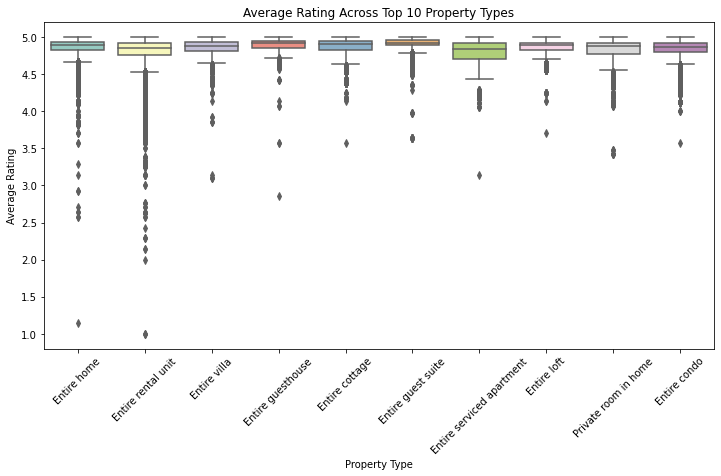
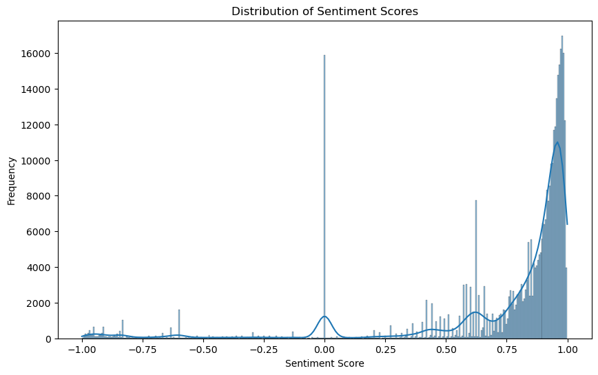

# Airbnb-Recommender-System

## Project Overview

This project builds a recommender system for Cape Town Airbnb listings to help hosts optimize pricing, occupancy, and guest satisfaction. Using data from [Inside Airbnb](https://insideairbnb.com/get-the-data/), the model suggests optimal prices based on listing features, guest sentiment, and occupancy patterns, helping hosts set competitive and profitable prices.

## Data Description

The dataset comprises information about Airbnb listings in Cape Town, focusing on features that influence pricing, occupancy, and guest satisfaction. Key data files include:

- **listings.csv**: Contains details about each listing, such as property type, location, amenities, and host information.
- **calendar.csv**: Shows the availability and pricing for each listing over time.
- **reviews.csv**: Provides guest feedback, which is used to derive sentiment scores.

### Key Columns

- **Property Details**: Includes `property_type`, `accommodates`, `bathrooms`, `bedrooms`, and `beds`.
- **Host Information**: Fields like `host_id`, `host_response_rate`, `host_is_superhost`, and `host_listings_count`.
- **Pricing and Occupancy**: Columns such as `price`, `availability`, and `number_of_reviews`.
- **Guest Sentiment**: Derived from guest comments using sentiment analysis to score the emotional tone of each review.
  
This structure enables the model to incorporate a wide range of factors influencing Airbnb's performance in Cape Town.

## Data Preprocessing

Data preprocessing involved several steps to prepare the dataset for modeling:

1. **Data Cleaning**:
   - Removed duplicate entries and irrelevant columns.
   - Addressed missing values through imputation for numerical columns and frequency encoding for categorical ones.

2. **Feature Engineering**:
   - Created new features such as `sentiment_score`, extracted from guest reviews using sentiment analysis.
   - Encoded categorical variables, applying frequency encoding to columns like `neighbourhood_cleansed` and `property_type` for improved model performance.

3. **Transformations**:
   - Log-transformed the `price` column to reduce skewness and approximate a normal distribution.

4. **Data Splitting**:
   - Split the data into training and testing sets, ensuring each listing appeared only once in the analysis.

These preprocessing steps allowed for better handling of categorical data and helped optimize model performance.

## Exploratory Data Analysis (EDA)

The EDA focused on understanding key trends and distributions in the dataset. Below are some visual insights generated:

1. **Price Distribution**: Showcasing the range and skewness of listing prices.  
   

2. **Property Type Breakdown**: An overview of listing types, such as entire homes, private rooms, etc.  
   

3. **Neighborhood Popularity**: Visualizing the distribution of listings across various neighborhoods.  
   

4. **Occupancy Rates by Property Type**: Analyzing how occupancy varies among different property types.  
   

5. **Sentiment Score Distribution**: Analysis of guest review sentiments, highlighting the frequency of positive and negative feedback.  
   

These visualizations provided a foundation for understanding factors like pricing, guest sentiment, and listing characteristics that inform the recommendations and predictions.

## Sentiment Analysis

To gain insights into guest satisfaction, sentiment analysis was performed on guest reviews. Using VADER sentiment analysis, each review was assigned a **compound sentiment score** ranging from -1 (most negative) to +1 (most positive).

1. **Sentiment Score Classification**: Reviews were classified as positive (score > 0) or negative (score ≤ 0).
2. **Top Positive Reviews**: Listings with the highest positive sentiment scores were identified to understand what guests appreciated most.

The sentiment analysis revealed a predominantly positive sentiment in reviews, indicating a high level of guest satisfaction across most listings.

This analysis helped highlight the factors contributing to positive guest experiences, crucial for optimizing listings.

## Modelling

### Prediction Model for Optimal Pricing

To identify the most accurate model for predicting Airbnb listing prices, several models were tested, with **LightGBM** emerging as the best-performing model due to its ability to handle large datasets efficiently and capture non-linear relationships effectively. This is the detailed summary of all the models used:

| **Model**                          	| **Train RMSE** 	| **Test RMSE** 	| **R² Score** 	|
|------------------------------------	|----------------	|---------------	|--------------	|
| Baseline Model: Linear Regression  	| 0.67           	| 0.76          	| 0.5961       	|
| Linear Regression (with PCA)       	| 0.71           	| 0.79          	| 0.5721       	|
| Decision Tree Model                	| 0.61           	| 0.70          	| 0.6412       	|
| Random Forest                      	| 0.17           	| 0.57          	| 0.7408       	|
| KNN Regression Model               	| 0.56           	| 0.68          	| 0.6616       	|
| Tuned KNN Model (with Grid Search) 	| 0.54           	| 0.68          	| 0.6621       	|
| XGBoost Model                      	| 0.43           	| 0.55          	| 0.7579       	|
| LightGBM Model                     	| 0.32           	| 0.54          	| 0.7699       	|
| Neural Network Model               	| 0.56           	| 0.64          	| 0.6900       	|

#### Best Model Selection: LightGBM

- **Metrics**: Evaluated using Root Mean Square Error (RMSE) and Mean Absolute Error (MAE).
- **Performance Summary**:
  - Train RMSE: 0.32, Test RMSE: 0.54
  - Train MAE: 0.21, Test MAE: 0.32
  - R²: 0.77

### Recommender System Model (Collaborative Filtering)

For personalized recommendations based on user sentiment, collaborative filtering methods were employed. These models utilize sentiment scores derived from guest reviews to make relevant listing suggestions.

#### Models Used

1. **Singular Value Decomposition (SVD)**: Generates recommendations based on sentiment scores with a matrix factorization approach.
2. **K-Nearest Neighbors with Baseline (KNNBaseline)**: Implements a user-based collaborative filtering model using Pearson similarity.

#### Model Evaluation Metrics

The following metrics were used to evaluate the collaborative filtering models:

| Model                | RMSE  | MAE   |
|----------------------|-------|-------|
| **SVD**              | 0.4491 | 0.2419 |
| **KNN with Baseline**| 0.4728 | 0.2594 |

The **SVD model** outperformed the other models in terms of RMSE and MAE, demonstrating its suitability for sentiment-driven recommendations.

### Summary

The **LightGBM** model was selected for optimal price prediction, while **SVD** was identified as the most effective model for the collaborative filtering-based recommender system. Together, these models support optimized pricing and personalized recommendations for Airbnb listings.

## Usage and Recommendations

### Usage

This section guides utilizing the models and data insights from this project:

1. **Prediction Model**:
   - Run the optimal pricing model (LightGBM) to predict competitive prices for Airbnb listings.
   - Use the model output to adjust pricing based on location, property type, seasonality, and other key factors identified.

2. **Recommender System**:
   - Use the SVD-based recommendation model to provide personalized listing suggestions for guests based on review sentiment.
   - Sentiment scores are calculated using the VADER sentiment analyzer, and listings with higher sentiment scores are prioritized for recommendations.

### Recommendations for Airbnb Hosts

1. **Optimize Pricing**: Adjust prices based on model recommendations to remain competitive in the market. Factors like location, amenities, and high-demand seasons should be leveraged.
2. **Enhance Guest Satisfaction**: High sentiment scores are strongly associated with positive reviews. Hosts should focus on consistently maintaining quality amenities and providing excellent customer service to improve these scores.
3. **Use Data Insights for Marketing**: Promote listings that have high occupancy rates, positive sentiment scores, and competitive pricing to attract new guests.

### Running the Code

To replicate the results:

1. Download the data files `listings.csv` and `reviews.csv` from the Inside Airbnb website for Cape Town.
2. Ensure all required libraries are installed.
3. Execute each notebook cell step-by-step, starting from data preprocessing to model evaluation.

## Future Improvements

### Potential Areas for Enhancing the Model

1. **Incorporate Additional Model Types**:
   - Explore ensemble models or advanced neural networks to improve predictive accuracy for pricing recommendations.
   - Implement advanced recommendation algorithms, such as Matrix Factorization techniques, for a more personalized recommender system.

2. **Dynamic Price Optimization**:
   - Develop a real-time pricing model that adapts to seasonal trends, regional events, and local demand surges.
   - Leverage time series analysis to predict occupancy rates and optimize prices dynamically based on booking patterns.

### Suggestions for Incorporating Additional Data

1. **Neighborhood Data**:
   - Enrich the dataset with location-based data such as crime rates, local attractions, and proximity to transportation hubs.
   - Incorporate data on neighborhood demographics to better understand target guest preferences.

2. **Market Competition Insights**:
   - Include data on competitive listings in the area, tracking prices, availability, and occupancy trends to provide more competitive pricing recommendations.
   - Analyze guest reviews from nearby listings to capture broader market sentiment and preferences.

3. **Host Activity**:
   - Integrate data on host activity, including response times, availability, and cancellation rates, to assess the impact on occupancy rates and guest satisfaction.

4. **Guest Demographics**:
   - Incorporate information on guest demographics (e.g., origin, age, travel purpose) to tailor the recommendation system more effectively to different guest profiles.
   - Analyze trends in guest demographics to identify potential new target audiences.

By incorporating these improvements, the model’s recommendations and insights can become more robust, relevant, and adaptable to changing market trends.

## Acknowledgements

This project was made possible by the following resources and contributions:

- **Inside Airbnb**: For providing detailed Airbnb listings, reviews, and availability data used in this analysis.
- **VADER Sentiment Analysis**: The VADER (Valence Aware Dictionary for Sentiment Reasoning) tool for analyzing guest review sentiments.
- **Surprise Library**: For facilitating the implementation of collaborative filtering models in the recommendation system.
- **Matplotlib, Seaborn, WordCloud**: Libraries that enabled visualizations of data insights and trends in the exploratory data analysis.

A special thanks to the developers and contributors of these resources and tools for their contributions to open-source software, making projects like this possible.

## Contributors

This project was a collaborative effort by the following team members:

- [**Peter Mabwa**](https://github.com/PMabwa)
- [**Festus Muchemi**](https://github.com/festus47)
- [**Kelvin Murithi**](https://github.com/kev065)
- [**Eric Muema**](https://github.com/am-eric)

We are grateful for each other's contributions and commitment to this project.
